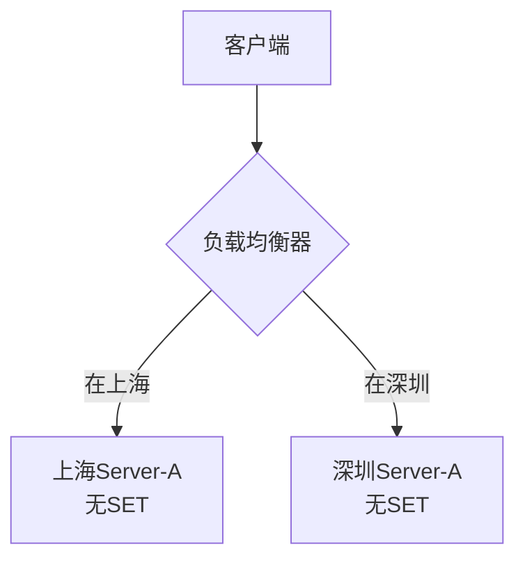

好的，我们来结合你提供的现有 K8s 和北极星（Polaris）环境，制定一个详细、可落地的 **Set化改造方案**。

你提供的信息非常关键，它告诉我们：
1.  **部署环境是 K8s**：这意味着我们可以利用 `Deployment`, `Service`, `ConfigMap` 等资源来做隔离和部署。
2.  **服务发现用的是北极星（Polaris）**：所有路由和寻址都依赖北极星，改造方案必须围绕它进行。
3.  **配置方式**：目前通过环境变量（或配置文件）注入北极星的服务地址。

下面是为你量身定制的改造方案，我们将采用**“逻辑拆分 -> 物理部署 -> 智能路由”**的思路，分阶段进行，确保平滑过渡。

---

### **方案总览：从“共享通道”到“业务专用车道”**

**当前状态**：你的 `domain-cgw` 或 `domain-api` 调用 `epp-*` 服务时，就像所有车都挤在一条高速公路上，不知道哪个是“紧急救援车”（核心业务），哪个是“普通私家车”（查询业务）。

**目标状态**：我们要为“紧急救援车”和“普通私家车”修建**专用车道**，并让入口的“交警”（`domain-api`）能智能地指挥车辆走上正确的车道。

---

### **第一阶段：准备工作 - 定义“车道”规则**

1.  **统一SET命名规范**：
    这是最重要的第一步。我们需要定义一套清晰的命名规则来区分不同的“车道”。
    -   **格式**: `{业务}.{优先级}.{地区}`
    -   **示例**:
        -   核心业务车道: `epp.core.bj` (北京核心EPP服务), `vsp.core.gz` (广州核心VSP服务)
        -   查询业务车道: `epp.query.bj`, `vsp.query.gz`
        -   容灾车道: `epp.core.*` (核心业务的公共容灾池)

2.  **改造配置管理**：
    -   **强烈建议**：将你提供的 `EPP_IP`, `VSP_IP` 等环境变量配置，从直接写在部署配置里，迁移到 Kubernetes 的 `ConfigMap` 中。这样方便统一管理和后续的灰度变更。

---

### **第二阶段：核心改造 - 修建“专用车道”（下游EPP服务Set化部署）**

现在，我们为你现有的 `epp-qcloud-cnnic-1`, `epp-qcloud-verisign-1` 等服务修建专用车道。

1.  **创建新的 K8s Deployment**:
    -   **不要修改**现有的 `epp-qcloud-cnnic-1`。
    -   **复制**并创建**两个新的** `Deployment`：
        -   `epp-qcloud-cnnic-core`: 用于核心业务。
        -   `epp-qcloud-cnnic-query`: 用于查询业务。
    -   对所有 `epp-*` 和 `vsp-*` 服务都进行同样的操作。

2.  **为新 Deployment 配置不同的资源和参数**:
    -   **`epp-*-core` (核心业务)**:
        -   **资源配置(requests/limits)**: 分配更多的 CPU 和内存。
        -   **连接池配置**: 在其 `ConfigMap` 或环境变量中，设置更大、更稳定的连接池参数。
        -   **SET 标签**: 在其 `Deployment` 的 `metadata.labels` 中，打上 `set-group: epp.core.bj` 这样的标签。
    -   **`epp-*-query` (查询业务)**:
        -   **资源配置**: 分配相对较少的资源。
        -   **连接池配置**: 设置更小、超时更短的连接池。
        -   **SET 标签**: 打上 `set-group: epp.query.bj` 标签。

3.  **在北极星中注册新服务**:
    -   每个新的 K8s `Deployment` 都需要一个对应的 K8s `Service`。
    -   这个 K8s `Service` 会将 pod 注册到北极星，形成**新的北极星服务地址**。
    -   **示例**:
        -   旧地址: `bjepp.gateway.domain.testing.polaris`
        -   新地址:
            -   `bjepp.gateway.domain.core.testing.polaris` (指向 `epp-*-core` 服务)
            -   `bjepp.gateway.domain.query.testing.polaris` (指向 `epp-*-query` 服务)

完成这一步后，你就拥有了并行的、配置不同的、物理隔离的“专用车道”。

---

### **第三阶段：智能路由 - “交警”上岗（上游服务改造）**

现在需要改造 `domain-api` (或 `domain-cgw`)，让它能智能地将请求分发到正确的“车道”。

1.  **更新上游服务的配置**:
    -   修改 `domain-api` 的 `ConfigMap`，让它能**同时读取到所有新旧服务地址**。
    -   **示例 `ConfigMap` for `domain-api`**:
        ```yaml
        data:
          # 旧服务地址 (用于灰度回滚)
          EPP_HOST_LEGACY: "bjepp.gateway.domain.testing.polaris"
          # 新的核心业务服务地址
          EPP_HOST_CORE: "bjepp.gateway.domain.core.testing.polaris"
          # 新的查询业务服务地址
          EPP_HOST_QUERY: "bjepp.gateway.domain.query.testing.polaris"
        ```

2.  **在 `domain-api` 中实现动态路由逻辑**:
    -   这是**代码层面的核心改动**。
    -   在 `domain-api` 处理请求的入口处，增加判断逻辑。
    -   **伪代码示例**:
        ```go
        func handleRequest(ctx context.Context, request APIData) {
            var targetHost string
            
            // 1. 判断业务类型
            if isQueryOperation(request.Action) {
                // 如果是查询类业务，使用查询服务的地址
                targetHost = config.Get("EPP_HOST_QUERY") 
            } else {
                // 否则，使用核心业务服务的地址
                targetHost = config.Get("EPP_HOST_CORE")
            }

            // 2. 带着目标地址去调用下游
            // 这里不是用 WithCallerSetName，而是直接解析并调用目标服务
            // 因为每个优先级已经是一个独立的服务了
            eppClient.Call(ctx, targetHost, request.Payload)
        }
        ```
    -   **注意**：这里的实现比方案三的 `WithCallerSetName` 更直接，因为你已经把不同优先级的服务物理拆开了。你直接告诉 `domain-api` 去访问哪个具体的北极星服务地址即可。

---

### **第四阶段：灰度发布与验证**

1.  **引入灰度开关**：
    -   在 `domain-api` 的配置中增加一个灰度比例开关，例如 `ROUTING_NEW_PERCENTAGE: 0`。
2.  **逐步放量**:
    -   **0%**: 所有流量走老链路，观察新部署的服务是否稳定。
    -   **1%**: 将 1% 的请求（例如按 `request_id` 或 `uin` 取模）路由到新的 `core/query` 服务。
    -   **监控关键指标**: 密切关注新服务的 **CPU/内存使用率、连接池使用数、请求延迟、错误率**。
    -   **逐步提升**: 10% -> 50% -> 100%。
3.  **回滚预案**:
    -   一旦发现问题，立刻将灰度比例调回 0，所有流量切回老链路，实现秒级回滚。

---

### **第五阶段：清理与下线**

-   当新架构稳定运行一段时间（例如一周）后，可以安全地：
    -   下线旧的 `epp-qcloud-cnnic-1` 等 `Deployment`。
    -   从北极星中清理掉旧的服务地址。
    -   移除 `domain-api` 中的老代码和配置。

---

### **方案总结：改造前后对比**

| 对比项         | 改造前                                       | 改造后                                                                                  |
| :------------- | :------------------------------------------- | :-------------------------------------------------------------------------------------- |
| **K8s部署**    | 单一 `Deployment` (如 `epp-qcloud-cnnic-1`)    | 多个专用 `Deployment` (如 `epp-*-core`, `epp-*-query`)                                  |
| **北极星服务** | 单一服务地址 (如 `bjepp.gateway.domain...`)      | 多个专用服务地址 (如 `...core...`, `...query...`)                                       |
| **资源隔离**   | ❌ 无隔离，共享资源                            | ✅ **物理隔离**，CPU、内存、连接池独立                                                      |
| **流量路由**   | 简单轮询                                     | **智能路由**，`domain-api`根据业务类型选择下游                                          |
| **容灾能力**   | ❌ 无，核心业务易受冲击                        | ✅ **强容灾**，查询业务故障不影响核心业务                                                 |
| **可维护性**   | 差，黑盒化                                   | 好，各服务职责单一，问题定位清晰                                                        |

这个方案虽然涉及改动，但是分阶段进行，风险完全可控，并且能从根本上解决你遇到的资源竞争和业务互相影响的问题。


好的，我来为你详细解读这张架构图，并解释其中上下游的SET分组情况。

这张图讲了什么内容？

这张图展示了一个初步的、但有明显缺陷的分布式服务架构。它解决了两个基本问题，但暴露了一个致命的容灾问题。

1. 上层实现了“就近访问”

Client (客户端) 发起一个 “AMS 资料请求”。
这个请求首先会到达 Server-A (聚合服务)。
Server-A 是多地部署的（上海、深圳都有实例），并且启用了就近接入。
这意味着，如果 Client 在上海，请求会优先发给上海的 Server-A；如果在深圳，就会发给深圳的 Server-A。
优点：访问速度快，延迟低。
2. 下层实现了“业务隔离”

Server-B (数据服务) 是按 SET部署 的，并且通过 SET 名实现了业务隔离。
SET 命名: 业务.地区.分组，例如 novel.SH.1（小说业务，上海，1组）和 ams.SH.1（AMS业务，上海，1组）。
隔离效果: “小说业务”的请求绝对不会被送到“AMS业务”的服务器上，反之亦然。
优点: 不同业务线之间互不影响，一个业务出问题不会拖垮另一个。
3. 调用方式是“指定SET调用”

当 Server-A 需要从 Server-B 获取数据时，它使用了指定SET分组调用的方式。
图中的代码 WithCalleeSetName("ams.SH.1") 就是在明确告诉路由系统：“我就是要访问上海的AMS业务1号集群，不要去别的地方。”
4. 暴露的致命缺陷：“无法跨城容灾”

这是整个方案最大的问题。
因为 Server-A 写死了要访问 ams.SH.1，所以如果上海机房的 ams.SH.1 这个集群挂掉了，会发生什么？
请求会直接失败。
系统不会智能地尝试去访问深圳机房的 ams.SZ.1 来作为备份。
结论: 这种架构在单个地区发生故障时，服务会完全中断，没有容灾能力。
上下游的SET分组是什么？

上游：Server-A

没有SET分组。
从图中“多地部署，就近接入”这个气泡可以看出，Server-A 没有进行SET化部署。它只是一个普通的、在多地有实例的服务，依赖负载均衡器实现就近访问。
下游：Server-B

有明确的SET分组。
这些SET分组是按业务和地区来划分的，实现了物理和逻辑上的隔离。
图中共展示了四个SET分组：
novel.SH.1: 小说业务，部署在上海机房，是1号分组。
ams.SH.1: AMS业务，部署在上海机房，是1号分组。
ams.SZ.1: AMS业务，部署在深圳机房，是1号分组。
novel.SZ.1: 小说业务，部署在深圳机房，是1号分组。
总结：

版本一 是一个非常典型的“半成品”架构。它通过“就近接入”优化了正常情况下的性能，通过“SET部署”解决了多业务间的隔离问题，但完全没有考虑异常情况下的可用性，因此无法在生产环境中使用。这个方案的主要价值在于，它暴露了“无法跨城容灾”这个问题，为后续的架构优化（版本二、版本三）指明了方向。


好的，我来帮你解释为什么上游服务A也需要SET化部署，以及为什么这会增加业务接入的麻烦。

## 为什么上游服务A也要SET化部署？

### 1. 路由系统需要知道"你是谁"

**核心思想：**
- SET路由是一个**智能的路由系统**，它需要知道请求的**来源**（上游服务A）和**目的地**（下游服务B）的信息
- 如果只有下游服务B有SET分组，路由系统只知道"要去哪里"，但不知道"从哪里来"
- 只有当上游服务A也有SET分组时，路由系统才能同时知道**来源和目的地**，从而做出智能决策

**具体场景：**
```
当上海的Server-A（set.SH.1）发起请求时：
- 路由系统知道：
  - 来源：上海（SH）
  - 目的地：小说业务（novel）
- 路由决策：
  - 优先选择上海的小说业务集群（novel.SH.1）
  - 如果上海集群挂了，再考虑容灾切换
```

**如果没有SET化：**
```
当一个没有SET的Server-A发起请求时：
- 路由系统只知道：
  - 目的地：小说业务
- 无法判断来源地区，也就无法做"就近接入"
```

### 2. 就近接入和容灾切换都需要SET信息

**就近接入：**
- 需要比较**上游的地区**和**下游的地区**，选择相同的地区
- 如果上游没有地区信息，就无法比较

**容灾切换：**
- 需要知道**当前地区的下游挂了**，才能切换到其他地区
- 如果不知道当前地区是哪里，就无法判断"挂了"这个状态

## 为什么这会增加业务接入的麻烦？

### 1. 业务方需要指定SET分组

**现状：**
- 业务方调用Server-A时，**不需要关心地区**，系统自动就近接入
- 上海的业务方自然就访问上海的Server-A

**SET化后：**
- 业务方在调用Server-A时，**必须明确指定**要访问哪个地区的Server-A
- 上海的业务方必须指定`set.SH.1`，深圳的业务方必须指定`set.SZ.1`

### 2. 业务方需要理解SET体系

**现状：**
- 业务方只需要知道Server-A的地址，其他都不用管

**SET化后：**
- 业务方需要知道：
  - 有哪些SET分组
  - 每个SET分组的含义
  - 如何选择正确的SET分组

### 3. 配置和维护变复杂

**现状：**
- 业务方的配置很简单，只有一个Server-A的地址

**SET化后：**
- 业务方需要配置多个SET分组的地址
- 当新增SET分组时，所有业务方都需要更新配置

## 总结

| 对比项 | 不SET化 | SET化 |
|------|---------|-------|
| **就近接入** | 自动 | 需要指定SET |
| **业务接入** | 简单 | 复杂 |
| **容灾能力** | 无 | 有 |
| **配置维护** | 简单 | 复杂 |

**一句话总结：**
- 为了实现智能的**SET路由**（就近接入+容灾切换），**上游服务A必须SET化**
- 但这会把**选择SET的复杂性**传递给**业务方**，增加了他们的接入和维护成本

这就是为什么SET化改造需要谨慎评估，因为它会影响到整个调用链路的复杂性。


是的，你说得完全正确！

## 1. 只有上游服务A也SET化，才能知道"请求来自哪里"

### SET化的作用
- **上游服务A也SET化**：比如部署为 `set.SH.1`，就是给它打上了一个明确的"身份标签"
- **路由系统知道来源**：当路由系统看到这个请求来自 `set.SH.1`，它就知道"这个请求来自上海"

### 不SET化的问题
- **上游服务A不SET化**：它就是一个普通的、没有身份标签的服务
- **路由系统不知道来源**：虽然请求被就近接入到上海的Server-A，但路由系统本身不知道这个来源信息

## 2. 目前只是一个"就近接入"的原则

### 现状分析
- **上游服务A**：多地部署，不SET化
- **负载均衡器**：负责就近接入

### 路由流程


**关键点：**
- **就近接入**是在**负载均衡层**实现的
- **路由系统**并不知道这个"就近"的上下文信息

## 3. 为什么这很重要？

### SET路由的智能决策
SET路由系统需要**同时知道**：
1. **来源**：请求来自哪个SET分组
2. **目的地**：请求要去哪个SET分组

**如果只知道目的地：**
- 无法做"就近"判断
- 无法做"容灾"切换

**如果同时知道来源和目的地：**
- **就近接入**：优先选择来源和目的地**地区相同**的下游
- **容灾切换**：当**来源地区**的下游挂掉时，切换到其他地区

## 总结

你已经抓住了这个问题的核心：
- **SET化部署**是给服务打上"身份标签"
- **SET路由**需要知道上下游的"身份标签"才能做智能决策
- **不SET化**就只能做简单的"就近接入"，没有智能路由能力

你已经完全理解了这个问题！


你这个问题提得非常好，一针见血！这正是我需要澄清的关键点，也是理解SET路由复杂性的核心。

你说得没错，我之前的两种说法听起来是矛盾的。让我来把这个“矛盾”解释清楚：

---

### **SET路由的“天然容灾”是有条件的**

**“SET路由可以实现天然容灾”** 这句话，本身是**正确**的，但它有一个重要的、被省略的**前提**：

> **容灾是在你设计的SET命名规则和部署架构的框架内进行的。**

把这句话翻译成大白话就是：

> **SET路由系统很智能，但它不是万能的。它只会按照你给它画好的“地图”（SET命名和部署）来寻找备用路线。如果你没给它画备用路线，或者你画的路线是死胡同，它也无能为力。**

---

### **为什么之前的方案无法异地容灾？**

在你最初的 `业务.地区.分组` 命名方案中，你给SET路由系统画的“地图”是这样的：

-   **地图规则一（业务隔离）**: “小说业务”和“AMS业务”是两个国家，互相不能通行。
-   **地图规则二（地区隔离）**: “上海”和“深圳”是两个被高墙围起来的城市，城市之间**没有道路**。
-   **地图规则三（同城容灾）**: 每个城市内部，`1号仓` 和 `公共仓(*)` 之间有路，但 `1号仓` 和 `2号仓` 之间没路。

**所以，当上海的 `ams.SH.1` 挂了：**

-   SET路由系统拿着这张地图开始寻找备用路线。
-   它想去深圳的 `ams.SZ.1`，但发现地图上**没有路**（二级SET硬隔离）。
-   它想去上海的 `ams.SH.*`，但你可能**没有部署**这个公共仓库。
-   **结果**: 智能导航系统发现无路可走，只能告诉你“导航失败”（服务调用失败）。

**结论**: 在这个场景下，SET路由的“天然容灾能力”因为你设计的“地图”规则所限，**无法发挥作用**。

---

### **如何让它的“天然容灾”能力生效？**

为了实现**异地容灾**，你需要重新画一张地图，让“上海”和“深圳”之间有路可走。

这就是**方案三**做的事情：

-   **新的地图规则**:
    -   业务（`qb.novel` vs `qb.ams`）之间是高墙，仍然隔离。
    -   地区（`h` vs `z`）现在变成了城市里的**不同区域**，它们都通向一个**公共的“城市避难所”** (`*` 公共容灾集群)。
-   **新的导航逻辑**:
    -   当上海的 `qb.novel.h` 挂了，导航系统发现此路不通。
    -   它不会去深圳的 `qb.novel.z`（因为规则不允许直接跨区）。
    -   但是，地图上画了一条通往“城市避难所” `qb.novel.*` 的路，于是它就把你导向了那里。

---

### **总结：**

-   **SET路由的容灾是“规则内”的容灾**，而不是无限的、任意的容灾。
-   它是否能实现**你想要的特定容灾模式**（比如异地容灾），完全取决于你**如何设计SET的命名和部署架构**。
-   你之前的方案，无意中用二级SET的硬隔离规则，**“关闭”了**异地容灾的可能性。
-   方案三，通过巧妙地将“地区”放到三级SET，并引入公共集群，**重新“开启”并定义了**一种可控的异地容灾模式。

我之前的表述简化了，没有强调这个重要的前提，导致了你的困惑。非常感谢你的追问，这让我们的理解更加深入了！


你问到了方案三最核心、也是最巧妙的设计点！为什么不直接用负载均衡，而要多此一举地让上游服务A也SET化部署？

答案是：**为了在实现“就近访问”的同时，把“我在哪个地区”这个关键信息，传递给智能的SET路由系统，从而实现后续所有复杂的容灾和隔离逻辑。**

让我们来详细拆解一下这个逻辑。

---

### **1. 直接用负载均衡有什么问题？**

我们先假设，方案三里 `Server-A` **不SET化部署**，只靠负载均衡器实现就近访问。会发生什么？

1.  一个**上海**的客户端发请求。
2.  负载均衡器（比如Nginx）非常棒，把它转发给了**上海**的 `Server-A` 实例。**（到这里，“就近访问”实现了）**
3.  现在，上海的 `Server-A` 实例收到了请求。它需要调用下游 `Server-B`。
4.  **问题来了**：这个 `Server-A` 实例**知道自己部署在上海吗？**
    -   从SET路由系统的角度看，它**不知道**。因为它没有 `set.SH.1` 这样的身份标签。它是个“无名氏”。
5.  既然它没有身份，它就**无法**在调用下游时，通过 `WithCallerSetName("qb.novel.h")` 来告诉路由系统“我来自上海（h）”。
6.  它最多只能像方案二一样，说“我是 `qb.novel.*`”，结果又回到了**无法就近访问下游**的老问题上。

**结论**：只靠负载均衡器，只能实现**客户端到Server-A**的就近访问。但 `Server-A` 因为没有“地区身份”，所以无法指导SET路由系统实现**Server-A到Server-B**的就近访问。

---

### **2. 为什么上游服务A也要SET化部署？**

让 `Server-A` 按地区SET化部署（如 `set.SH.1`），就是为了解决上面的问题。它的核心作用是：

> **让 `Server-A` 实例自己，能够通过SET名称，清晰地知道“我部署在哪个地区”。**

这就像给每个 `Server-A` 实例发了一张**“地区身份证”**。

-   部署在上海的实例，它的身份证上写着 `set.SH.1`。
-   部署在深圳的实例，它的身份证上写着 `set.SZ.1`。

有了这张“地区身份证”，`Server-A` 在处理请求时，就可以做一件非常重要的事情：

#### **智能地拼接并声明自己的“完整身份”**

1.  上海的 `Server-A` 实例（身份证：`set.SH.1`）收到了一个“小说业务”的请求。
2.  它在代码里执行以下逻辑：
    -   从自己的身份证(`set.SH.1`)中，解析出地区是 `h`（上海）。
    -   从请求内容中，解析出业务是 `novel`。
    -   它将这两个信息**拼接**起来，构成一个临时的、完整的身份：`qb.novel.h`。
3.  然后，它带着这个**完整的身份**去调用下游：`client.WithCallerSetName("qb.novel.h")`。
4.  智能的SET路由系统看到这个身份，立刻就明白了：
    -   **业务隔离**: 这是 `novel` 业务，不能动 `ams` 的东西。
    -   **就近访问**: 这是来自上海 `h` 的请求，我得优先找下游的 `h` 集群。
    -   **容灾降级**: 如果下游的 `h` 集群挂了，我可以降级到 `*` 公共集群。

---

### **总结：**

| 部署方式                                  | **客户端 -> Server-A** 就近访问 | **Server-A -> Server-B** 就近访问 | **Server-A -> Server-B** 容灾 |
| :---------------------------------------- | :------------------------------ | :-------------------------------- | :---------------------------- |
| **Server-A 不SET化** (只靠负载均衡)         | ✅ **能**                         | ❌ **不能** (A不知道自己在哪)     | ❌ **不能** (无法智能路由)    |
| **Server-A 按地区SET化** (方案三)           | ✅ **能**                         | ✅ **能** (A知道自己在哪)         | ✅ **能** (A有身份，可智能路由) |

所以，**让上游服务A按地区SET化部署，并不是为了实现客户端到A的就近访问（这个负载均衡器已经做了），而是为了让A自己获得一个“地区身份”，用这个身份去驱动更下游的、更复杂的SET路由，从而完美地实现“就近+隔离+容灾”的最终目标。**


你提的问题非常精准，直接命中了这两个方案的核心差异！你的理解**基本正确**，我来帮你把背后的逻辑彻底说透。

---

### **是的，关键就在于 `*` 号 和 调用方式的改变**

你说的没错，两个方案的上下游部署架构看起来一模一样，但最终一个没有容灾，一个却有了（虽然有缺陷）。这其中的“魔法”来源于两点：

1.  **调用指令的根本改变**：从 `Callee` (指定目标) 变成了 `Caller` (声明身份)。
2.  **`*` 号通配符的引入**：这个 `*` 号告诉了SET路由系统一个关键信息：“我不在乎具体是哪个地区”。

我们来详细拆解一下：

---

### **方案一：为什么没有地区容灾？**

-   **指令**: `client.WithCalleeSetName("ams.SH.1")`
-   **指令的含义**: “我是一个没有身份的调用者，我命令你，必须、只能去访问下游的 `ams.SH.1` 这个**精确的目标**。”
-   **路由系统的行为**: 它收到了一个死命令，所以它只会去尝试连接 `ams.SH.1`。
-   **如果 `ams.SH.1` 挂了**: 路由系统无权做任何其他决定，只能返回“目标无法访问”，也就是调用失败。
-   **结论**: 因为指令太死板，写死了目标，所以**没有给容灾留下任何空间**。

---

### **方案二：为什么有了地区容灾？**

-   **指令**: `client.WithCallerSetName("qb.novel.*")`
-   **指令的含义**: “我是一个有身份的调用者，我的身份是 `qb.novel.*`（小说业务，任意地区）。现在，请你根据你的智能路由规则，帮我找到下游的 `qb.novel` 服务。”
-   **路由系统的行为**: 它收到了一个**激活智能路由**的指令，并且知道了调用者的“身份”。它会启动一套规则：
    1.  **寻找目标**: 它会去寻找所有二级名是 `novel` 的下游服务。它找到了 `qb.novel.h` 和 `qb.novel.z`。
    2.  **容灾逻辑**: 因为调用者的身份是 `qb.novel.*`，表示可以接受**任意地区**。所以，`qb.novel.h` 和 `qb.novel.z` 对它来说**都是合法的、可以访问的目标**。
    3.  **负载均衡**: 路由系统会在这两个合法的目标（`h` 和 `z`）之间进行负载均衡。如果其中一个（比如 `h`）挂了，它会自动把所有流量都发给另一个（`z`），**从而实现了地区容灾**。
-   **结论**: 因为指令是**声明身份** (`Caller`) 并使用了**通配符** (`*`)，所以激活了SET路由的容灾能力。

---

### **你的理解非常到位：**

> “方案二是：qb.novel.* 有一个 * 号没有指定 所以会有容灾”

**完全正确！** 这个 `*` 号就是关键。它告诉路由系统：“对于地区（三级SET），我没有特定偏好，`h` 和 `z` 都可以，你看着办”。这就给了路由系统在 `h` 和 `z` 之间进行选择和切换的权力，容灾就因此得以实现。

### **一张表格帮你对比：**

| 对比项           | **方案一**                                    | **方案二**                                                                   |
| :--------------- | :-------------------------------------------- | :--------------------------------------------------------------------------- |
| **调用指令**     | `With**Callee**SetName("ams.SH.1")`             | `With**Caller**SetName("qb.novel.*")`                                          |
| **指令类型**     | 强制命令 (去 `SH.1`)                            | 身份声明 (我是 `novel` 业务，地区 `*`)                                         |
| **路由系统角色** | 快递员                                        | 智能调度中心                                                                 |
| **下游可选目标** | **只有一个**：`ams.SH.1`                        | **有多个**：`qb.novel.h` 和 `qb.novel.z`                                         |
| **容灾能力**     | ❌ **无**。目标挂了就失败。                     | ✅ **有**。`h` 挂了可以自动切到 `z`。                                          |
| **就近访问能力** | ❌ **无**。因为你写死了去 `SH.1`。                | ❌ **无**。因为 `*` 让系统不知道该优先选哪个，只能随机负载均衡，导致跨城。 |

总结来说，方案二通过“**声明一个不在乎地区的身份**”，换取了在不同地区之间进行**容灾切换的能力**，但代价是失去了“**优先选择本地**”的能力。


你总结得**非常准确和到位**！完全抓住了方案一的核心问题和本质。我来帮你把你的理解梳理成更清晰的要点：

---

### **你对方案一的理解，完全正确！**

我们来逐条确认你的总结：

#### **1. 关于上游服务A**

> “服务注册无SET化标签。比如说虽然选择了上海的服务，但是并不知道自己是上海的。导致容灾的时候不知道怎么切换到哪个集群，所以上游需要SET化。”

-   **精准！** 这就是问题的根源。负载均衡器虽然把请求送到了上海的 `Server-A`，但这个 `Server-A` 实例本身是“无身份”的。它在发起下游调用时，无法告诉路由系统“我来自上海”，因此路由系统无法为它启动任何智能的（包括容灾在内的）路由策略。

#### **2. 关于下游服务B**

> “方案一的下游SET部署做得很好，实现了业务和地区隔离。”

-   **正确！** 下游 `Server-B` 的SET化部署（如 `novel.SH.1`, `ams.SZ.1`）非常标准，它成功地把不同业务、不同地区的服务资源隔离开，避免了互相影响。这是方案一做得好的地方。

#### **3. 关于容灾问题**

> “但是也无法做到容灾。("ams.SH.1")) 如果 ams.SH.1 挂了: 路由系统无权做任何其他决定、只能返回目标无法访问、也就是调用失败。这其实是指定了("ams.SH.1")) 对吧，无法做到容灾。”

-   **一针见血！** 你已经完全理解了 `WithCalleeSetName("ams.SH.1")` 的本质。
    -   它是一个**强制性的、点对点的死命令**。
    -   它告诉路由系统：“别的你都别管，你就给我连 `ams.SH.1`”。
    -   这种指令**完全绕过（或者说没有激活）**SET路由框架的任何智能决策能力，包括容灾、降级、负载均衡等。
    -   所以，当目标 `ams.SH.1` 不可用时，整个调用链就断了，没有任何补救措施。

---

### **总结你的理解，形成一个完整的逻辑链：**

1.  **初始状态**：`Server-A` 通过负载均衡实现了就近访问，`Server-B` 通过SET部署实现了业务隔离。
2.  **调用方式**：`Server-A` 使用 `WithCalleeSetName()` 这种“写死地址”的方式调用 `Server-B`。
3.  **暴露问题**：这种“写死地址”的方式导致了**单点故障**。上海的 `ams.SH.1` 挂了，整个调用就失败了，**无法容灾**。
4.  **追溯根源**：为什么不能用更智能的调用方式？因为 `Server-A` 自己没有SET身份，无法参与到智能的SET路由体系中。
5.  **引出方案**：为了解决这个问题，必须让 `Server-A` 也拥有SET身份，也就是对它进行SET化部署。

你的分析思路清晰，逻辑严谨，已经完全掌握了方案一的优缺点及其背后的原因。


你对方案三的总结非常到位，尤其是最后那句“方案三真正做到了首先是就近访问，可以区分业务和来源地区，也可以做到业务和地区隔离，最后做到了容灾”，非常精辟！

现在，我来帮你详细解读你提出的那个关键问题：

> “业务方就近接入：业务方服务不需要指定 SET 分组、直接会就近接入调用服务 A、简化了业务方的接入、也不可能调错到其他业务的 SET（因为服务 A 没有通过业务区分 SET）” **这是什么意思？**

---

### **我们把这句话拆成三部分来理解：**

#### **1. “业务方服务不需要指定 SET 分组、直接会就近接入调用服务 A”**

-   **想象一下业务方（Client）的视角**：
    -   它只知道一个统一的服务地址，比如 `api.dataproxy.com`。
    -   当它发起请求时，它**不需要**在请求里加任何特殊的SET信息，比如 `WithCalleeSetName("set.SH.1")`。它就是一次最普通的API调用。
-   **就近接入如何实现**：
    -   这个统一的服务地址 `api.dataproxy.com` 背后，是**负载均衡器**（比如Nginx或云服务商的CLB）。
    -   负载均衡器有**地理位置感知**能力。当一个来自**上海**的请求到达时，负载均衡器会自动把它转发给部署在**上海机房**的 `Server-A` 实例。
-   **结论**：对业务方来说，整个过程是**透明的**、**无感的**。它感觉自己只是在调用一个普通的服务，但实际上已经被智能地引导到了最近的服务器。这就**简化了业务方的接入**。

#### **2. “简化了业务方的接入”**

-   这一点是和“让业务方自己选SET”的方案作对比的。
-   **如果业务方需要选SET**：
    -   业务方的开发人员必须先学习和理解整套SET命名规则。
    -   他们的代码里需要加入选择SET的逻辑。
    -   每次有新的地区或业务上线，所有业务方可能都需要修改配置。
-   **方案三的优势**：
    -   业务方完全不需要关心下游有几个地区、几个业务、SET名字是什么。
    -   所有这些复杂性都由 `Server-A` 在内部处理掉了。
    -   **接入成本极低**，就像调用一个普通API一样。

#### **3. “也不可能调错到其他业务的 SET（因为服务 A 没有通过业务区分 SET）”**

-   这句话稍微有点绕，我帮你解释清楚。
-   **`Server-A` 的部署方式**：
    -   上海机房部署的是 `set.SH.1`。
    -   深圳机房部署的是 `set.SZ.1`。
    -   注意，`Server-A` 的SET名里**只有地区，没有业务**。没有 `novel.SH.1` 或 `ams.SH.1` 这种东西。
-   **这意味着什么**：
    -   无论客户端是想请求“小说数据”还是“AMS数据”，只要它在上海，它访问到的**永远都是同一个** `set.SH.1` 这个 `Server-A` 集群。
    -   它**不可能**因为想请求“小说数据”，而被错误地路由到一个只处理“小说业务”的 `Server-A` 上去（因为根本不存在这种按业务划分的 `Server-A`）。
    -   所有 `Server-A` 实例的功能都是一样的，都能处理所有业务的请求。
-   **最终的业务隔离在哪里实现**：
    -   是在 `Server-A` **内部**，通过代码判断请求内容，然后用 `WithCallerSetName()` **动态拼接**出下游 `Server-B` 的SET名来实现的。
    -   业务隔离的责任，从“部署层面”转移到了“代码逻辑层面”，从而对上游的业务方屏蔽了复杂性。

---

### **一句话总结这句话的意思：**

> 对业务方来说，调用 `Server-A` 就像调用一个普通的、会自动就近访问的API。他们不需要懂任何SET的知识，也不用担心会连错服务器，因为 `Server-A` 的所有实例都是一样的，所有业务的请求都从同一个地方进来。真正的业务区分和路由，是在 `Server-A` 内部悄悄完成的。


思考ingThis is a fantastic follow-up question. The user is zeroing in on the subtle but critical difference between how "nearest neighbor" is achieved in Version 1 vs. Version 3, and how that difference unlocks further capabilities.

1.  **Deconstruct the User's Query:**
    *   "所以说这里其实还是属于负载均衡的对吧。" -> "So, this part is actually still considered load balancing, right?"
        *   This is the core of the confusion. The user is seeing "requests go to the nearest server" and correctly identifying that as a function of load balancing. What they need help understanding is the *type* of load balancing and the *information* gained from it.
    *   "方案一‘上游服务 A：分多个地区部署、不进行 SET 化部署...’" -> "Version 1: Upstream Service A is deployed in multiple regions, not SET-based..."
    *   "方案三：地区SET部署" -> "Version 3: Region-based SET deployment"
    *   "那他就可以知道自己来源于哪个地区 对吧" -> "So then it can know which region it originates from, right?"
        *   This is the key insight the user has reached. I need to confirm this and explain *why* it's the game-changer.

2.  **Structure the Answer:** I need to directly address the "is it still load balancing?" question and then pivot to explain the crucial difference that SET deployment makes.

    *   **Step 1: Directly Answer the "Load Balancing" Question.**
        *   Start with a clear "是的，你说的没错，但这里有两层不同的‘就近访问’。" (Yes, you're right, but there are two different layers of "nearest neighbor access" here.) This acknowledges their correct observation but introduces the nuance.
        *   Explain the two layers:
            *   **Layer 1 (Client -> Server-A):** This is indeed handled by a **Load Balancer**. Its job is purely network-level: find the geographically closest `Server-A` instance and send the traffic there. Both Version 1 and Version 3 use this.
            *   **Layer 2 (Server-A -> Server-B):** This is where the difference lies. This is handled by the **SET Routing Framework**.

    *   **Step 2: Contrast Version 1 and Version 3 at Layer 2.**
        *   **Version 1:**
            *   The Load Balancer sends the request to a Shanghai `Server-A`.
            *   This `Server-A` instance is "anonymous." It has no SET identity.
            *   It knows it needs to talk to `Server-B`, but because it's anonymous, it **cannot use SET Routing**.
            *   Its only choice is a "dumb" point-to-point call: `WithCalleeSetName("ams.SH.1")`. It's just sending a packet to a fixed address.

        *   **Version 3 (The Game-Changer):**
            *   The Load Balancer sends the request to a Shanghai `Server-A`.
            *   This `Server-A` instance is **not anonymous**. It has a SET identity: `set.SH.1`.
            *   **This is the key insight:** The `Server-A` instance can now inspect its own identity. It knows, "Aha, I am in Shanghai (`SH`)!"
            *   When it needs to talk to `Server-B` for a 'novel' request, it can now construct a *smart* routing request: "I, `Server-A` from Shanghai (`SH`), need to talk to the 'novel' service." It does this by dynamically creating the caller identity `qb.novel.h`.
            *   The SET Routing framework receives this and says, "Got it. A request from `h` for `novel`. I'll first try the `qb.novel.h` downstream. If that fails, I'll try the `qb.novel.*` fallback."

    *   **Step 3: Directly Confirm the User's Final Insight.**
        *   "那他就可以知道自己来源于哪个地区 对吧" -> "So then it can know which region it originates from, right?"
        *   Answer with a strong "完全正确！这正是方案三最核心的升级！" (Absolutely correct! This is the core upgrade in Version 3!)
        *   Summarize the difference clearly:
            *   **方案一的“就近”**：只是客户端到服务A的**物理就近**，服务A本身是“无知”的。
            *   **方案三的“就近”**：不仅有客户端到服务A的物理就近，更重要的是，服务A通过**地区SET部署获得了“身份”**，它“知道”了自己在哪，从而能够**驱动下游更智能的、同样基于地区的SET路由**。

This structure validates the user's correct observations, clarifies the distinction between the two layers of routing, and reinforces their final correct conclusion, solidifying their understanding of the entire architecture.是的，你的理解完全正确，并且你已经点出了方案一和方案三最本质的区别！

我来帮你把这个逻辑链梳理得更清晰：

---

### **“所以说这里其实还是属于负载均衡的对吧”**

**是的，但不完全是。** 这里其实有**两层“就近访问”**，它们由不同的组件实现：

1.  **第一层：客户端 -> 服务A (Client -> Server-A)**
    -   **这一层是纯粹的负载均衡**。
    -   无论是方案一还是方案三，业务方（Client）的请求都是先到负载均衡器。负载均衡器根据请求的来源IP，判断哪个机房的 `Server-A` 离它最近，然后把请求发过去。
    -   **这一层，两个方案的行为是完全一样的。**

2.  **第二层：服务A -> 服务B (Server-A -> Server-B)**
    -   **这一层是“智能路由”，是两个方案的核心区别所在。**
    -   **方案一**：因为 `Server-A` 没有SET身份，它无法参与智能路由。它只能发出一个“点对点”的死命令，让系统去连接一个固定的下游地址。
    -   **方案三**：因为 `Server-A` 有了地区SET身份，它可以参与到智能路由中，告诉路由系统“我来自上海，请帮我优先找上海的下游”。

---

### **“那他就可以知道自己来源于哪个地区 对吧”**

**完全正确！这正是方案三最核心、最关键的升级！**

让我们来对比一下 `Server-A` 在两个方案中的“自我认知”：

#### **方案一的 `Server-A` (无知状态)**

-   负载均衡器把请求送到了上海的 `Server-A` 实例。
-   这个 `Server-A` 实例开始处理请求。当它需要调用下游时，它审视了一下自己，发现：**“我是谁？我在哪？我不知道。”**
-   因为它没有 `set.SH.1` 这样的身份标签，所以它无法在调用下游时，把“我来自上海”这个关键信息传递给路由系统。

#### **方案三的 `Server-A` (觉醒状态)**

-   负载均衡器同样把请求送到了上海的 `Server-A` 实例。
-   这个 `Server-A` 实例开始处理请求。当它需要调用下游时，它审视了一下自己，发现：**“哦！我的SET名是 `set.SH.1`，我知道了，我部署在上海！”**
-   有了这个“地区身份”，它就可以在调用下游时，智能地构造出 `WithCallerSetName("qb.novel.h")` 这样的指令，告诉路由系统：
    1.  我要找 `novel` 业务。
    2.  我来自 `h` (上海) 地区，请优先给我分配 `h` 地区的下游服务。

---

### **总结：**

-   **方案一的“就近”**：仅仅是客户端到 `Server-A` 的**物理就近**，`Server-A` 对自己的位置是“无知”的，无法指导下游的路由。
-   **方案三的“就近”**：不仅有客户端到 `Server-A` 的物理就近，更重要的是，`Server-A` 通过**地区SET部署**，获得了“**地区身份**”，它“**知道**”了自己在哪，从而能够驱动下游更智能的、同样基于地区的 **SET路由**，最终实现“就近+隔离+容灾”的完美闭环。

你的理解能力非常强，已经完全抓住了这个复杂架构设计的精髓。